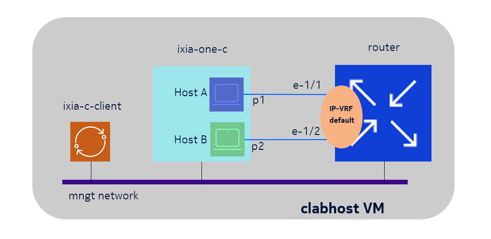
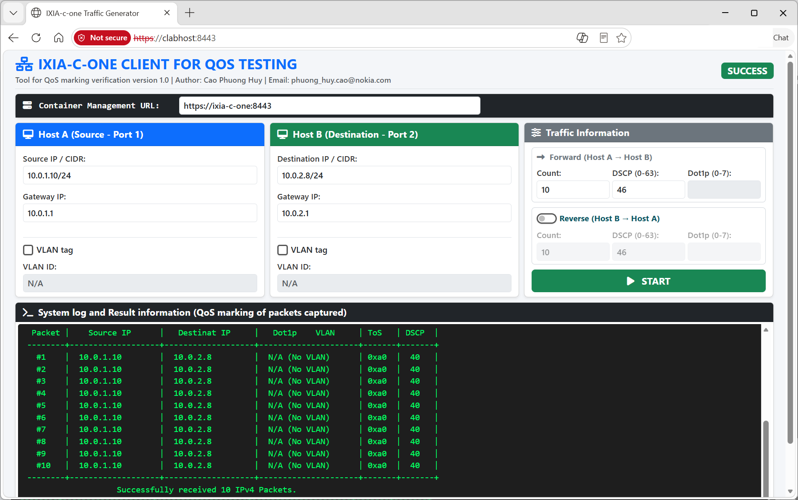

# DSCP and Dot1p marking/remarking test
A simple setup using a web-based client to control ixia-c-one for QoS marking test with all nodes are containers on containerlab.
## Topology & Test Overview
Here is a simple topology with two devices participating in testing.

* **Tester**: ixia-c-one container
* **DUT (Device Under Test)**: Nokia 7220 IXR-D2L router

Two hosts, host A connected to `eth-1` and host B connected to `eth-2` are created inside **ixia-c-one** testers. 

<p align="center">
  
</p>

* **Traffic Generation:** IP packets encapsulated in Ethernet frames (with user-defined DSCP and optional 802.1p values) are transmitted between the two hosts.
* **Verification:** The tester monitors the ports, captures incoming frames, and verifies the QoS markings (DSCP and 802.1p).
* **Control & Configuration:** All test actions are executed based on parameters defined via the web interface of a third container in the setup, **ixia-c-client** which is hidden from the topo above.

In the setup, the DUT is a router with interface eth-1/1 has IP 10.0.1.1/24 and interface eth-1/2 has IP 10.0.2.1/24. Both ports set with no VLAN. If the ip packets marked with DSCP 46 when being sent from host B, they will be re-marked with DSCP 40 by the router.

The DUT can be replaced by another box or a network for more complicated setup.
## Deploy the lab:

Clone the repo to your VM: 
```console
# git clone https://github.com/caophuonghuy/dscp-remarking
```
Navigate to the lab folder:
```console
# cd dscp-remarking/
```
Deploy the lab
```console
# clab deploy -t marking-w-gui.yaml
```
Access the web interface at:

https://ip-of-the-VM-which-host-containerlab:8443

and start the test. The web interface appears as below.

<p align="center">
  
</p>

## Tools with CLI interface

Older version using the client with CLI tools. Please 
navigate to Archive folder if CLI is prefered.

Navigate to the Archive folder:

```console
# cd Archive/
```
Deploy the lab

```console
# clab deploy -t qos-marking.yaml
```

Access the client by command:

```console
# docker exec -it ixia-c-client sh
```

Run the client tool
```console
# ./marking_test_tool
```
Enter the configuration of client (IP address, gateway, VLAN, dot1p, number of ip packet, dscp value in ip packets) and see the result.

In case you do not have VLAN setup, can use command

```console
# ./dscp_test_tool
```
to do a quick one for just DSCP test with null port in both sides.
